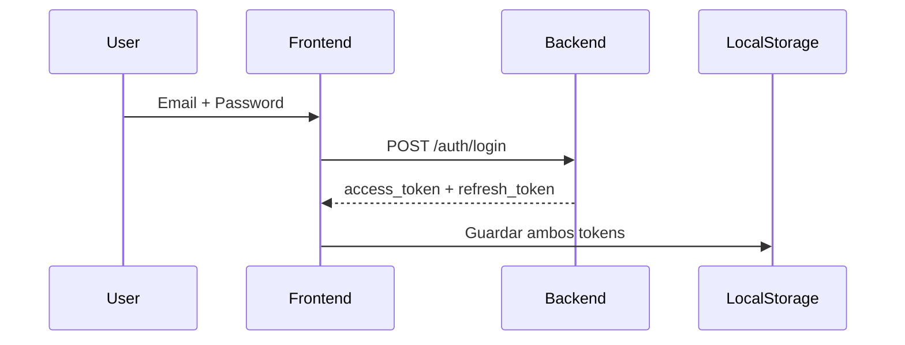
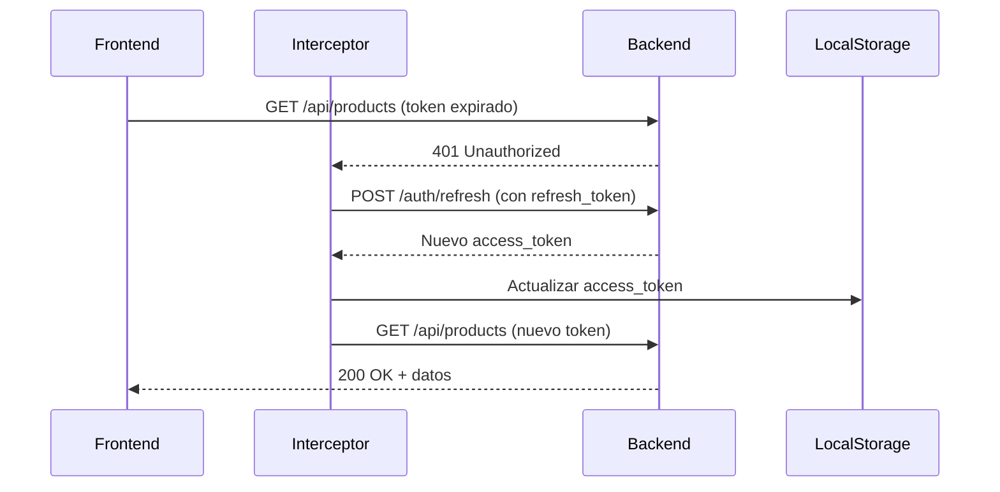
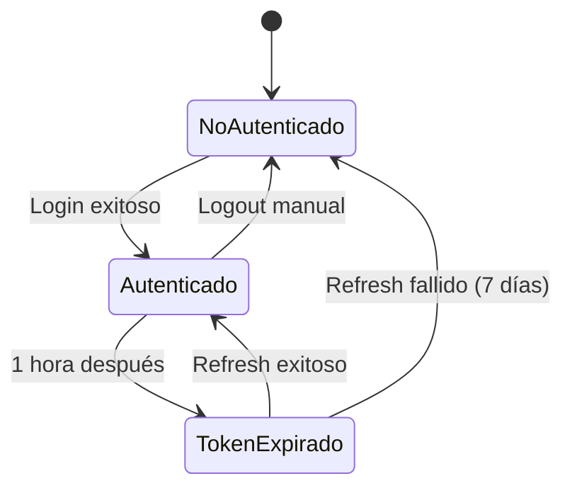

# 🔄 Sistema de Refresh Token Automático

> **Renovación transparente de tokens** para mantener la sesión del usuario sin interrupciones

---

## 📋 Tabla de Contenidos

- [Flujo de Autenticación](#flujo-de-autenticación)
- [Arquitectura](#arquitectura)
- [Implementación](#implementación)
- [Manejo de Errores](#manejo-de-errores)
- [Testing](#testing)
- [Troubleshooting](#troubleshooting)

---

## 🔐 Flujo de Autenticación

### **1. Login Inicial**



**Respuesta del Login:**
```json
{
  "success": true,
  "data": {
    "access_token": "eyJhbGciOi...",  // Expira en 1 hora
    "refresh_token": "eyJhbGciOi...", // Expira en 7 días
    "token": "eyJhbGciOi...",          // Alias de access_token
    "user": { ... },
    "org_id": 1
  }
}
```

### **2. Peticiones Autenticadas**

```typescript
// Automático en cada petición HTTP
Authorization: Bearer <access_token>
```

### **3. Token Expirado (401) → Renovación Automática**



---

## 🏗️ Arquitectura

### **Componentes del Sistema**

#### **1. AuthService** (`auth.service.ts`)
✅ **Responsabilidades:**
- Guardar tokens en localStorage (login/signup)
- Método `refreshAccessToken()` para renovar access_token
- Limpiar sesión cuando falla el refresh

```typescript
refreshAccessToken(): Observable<{ access_token: string }> {
  const refreshToken = localStorage.getItem('refresh_token');
  
  return this.http.post(`${this.apiUrl}/auth/refresh`, 
    { refresh_token: refreshToken },
    { headers: { Authorization: `Bearer ${refreshToken}` } }
  ).pipe(
    map(response => {
      // Actualizar solo access_token, mantener refresh_token
      localStorage.setItem('token', response.access_token);
      localStorage.setItem('access_token', response.access_token);
      return response;
    })
  );
}
```

#### **2. OAuth2Interceptor** (`oauth2.interceptor.ts`)
✅ **Responsabilidades:**
- Agregar `Authorization: Bearer <token>` a peticiones protegidas
- Detectar errores 401 (token expirado)
- Intentar renovación automática con refresh_token
- Reintentar petición original con nuevo token
- Redirigir a login solo si falla el refresh

**Flujo del Interceptor:**
```typescript
1. Petición → Agregar access_token
2. Respuesta 401 → Iniciar refresh
3. Refresh exitoso → Reintentar petición original
4. Refresh fallido → Logout + redirect login
```

**Manejo de Múltiples Peticiones:**
- Si varias peticiones reciben 401 simultáneamente
- Solo la primera inicia el refresh
- Las demás esperan al resultado usando `BehaviorSubject`
- Todas reintentan con el nuevo token

#### **3. AuthGuard** (`auth.guard.ts`)
✅ **Responsabilidades:**
- Verificar existencia de `access_token` y `refresh_token`
- Bloquear acceso a rutas protegidas sin tokens
- **NO intenta renovar** (eso lo hace el interceptor)

```typescript
export const authGuard: CanActivateFn = (route, state) => {
  const token = auth.getAuthToken();
  const refreshToken = localStorage.getItem('refresh_token');

  // Si faltan tokens → login
  if (!token || !refreshToken) {
    return router.createUrlTree(['/auth/login']);
  }

  // Si existen tokens → permitir acceso
  // (El interceptor renovará automáticamente si están expirados)
  return true;
};
```

---

## 🔧 Implementación

### **Tokens en LocalStorage**

```javascript
// Después del login exitoso
localStorage.setItem('token', response.access_token);
localStorage.setItem('access_token', response.access_token);
localStorage.setItem('refresh_token', response.refresh_token);
localStorage.setItem('user', JSON.stringify(response.user));
localStorage.setItem('org_id', response.org_id);
```

### **Endpoint de Refresh**

**Request:**
```http
POST /auth/refresh
Authorization: Bearer <refresh_token>
Content-Type: application/json

{
  "refresh_token": "<refresh_token>"
}
```

**Response (Exitoso):**
```json
{
  "access_token": "eyJhbGciOi...",
  "token": "eyJhbGciOi..."  // Alias
}
```

**Response (Error):**
```json
{
  "success": false,
  "message": "Invalid or expired refresh token"
}
```

### **Configuración de Tiempos**

| Token | Duración | Configuración Backend |
|-------|----------|----------------------|
| **access_token** | 1 hora | `ACCESS_TOKEN_EXPIRE_MINUTES = 60` |
| **refresh_token** | 7 días | `REFRESH_TOKEN_EXPIRE_MINUTES = 10080` |

---

## ⚠️ Manejo de Errores

### **Escenarios y Comportamiento**

| Escenario | Comportamiento |
|-----------|---------------|
| **Access token expirado** | ✅ Renovación automática con refresh_token |
| **Refresh token expirado** | ❌ Logout + redirect `/auth/login?reason=session_expired` |
| **Ambos tokens inválidos** | ❌ Logout + redirect `/auth/login` |
| **Sin conexión durante refresh** | ❌ Error de red + notificación al usuario |
| **Backend devuelve 401 en refresh** | ❌ Logout + redirect login |

### **Logs de Depuración**

```typescript
console.log('[OAuth2Interceptor] INTERCEPTADO: /api/products');
console.log('[OAuth2Interceptor] Token presente: true');
console.warn('[OAuth2Interceptor] 401 Unauthorized - Intentando renovar token...');
console.log('[OAuth2Interceptor] ✅ Token renovado exitosamente');
console.error('[OAuth2Interceptor] ❌ Falló el refresh token:', error);
```

---

## 🧪 Testing

### **Caso 1: Renovación Exitosa**

```typescript
// 1. Login
POST /auth/login → Guardar tokens

// 2. Esperar 1 hora (access_token expira)

// 3. Hacer petición
GET /api/products
→ 401 Unauthorized
→ POST /auth/refresh (automático)
→ Nuevo access_token
→ GET /api/products (reintento exitoso)
```

### **Caso 2: Múltiples Peticiones Simultáneas**

```typescript
// Hacer 5 peticiones al mismo tiempo con token expirado
Promise.all([
  http.get('/api/products'),
  http.get('/api/suppliers'),
  http.get('/api/warehouses'),
  http.get('/api/users'),
  http.get('/api/roles')
]);

// Resultado esperado:
// - Solo 1 llamada a /auth/refresh
// - Las 5 peticiones esperan el resultado
// - Todas se reintentan con el nuevo token
```

### **Caso 3: Refresh Token Expirado**

```typescript
// 1. Login
POST /auth/login → Guardar tokens

// 2. Esperar 7 días (refresh_token expira)

// 3. Hacer petición
GET /api/products
→ 401 Unauthorized
→ POST /auth/refresh (automático)
→ 401 Unauthorized (refresh también expiró)
→ Logout + redirect /auth/login?reason=session_expired
```

---

## 🔍 Troubleshooting

### **Problema: Tokens no se guardan**

```typescript
// ✅ Verificar en AuthService.saveAuthData()
localStorage.setItem('access_token', response.data.access_token);
localStorage.setItem('refresh_token', response.data.refresh_token);

// ✅ Verificar en consola del navegador
console.log(localStorage.getItem('access_token'));
console.log(localStorage.getItem('refresh_token'));
```

### **Problema: Loop infinito de refresh**

```typescript
// ❌ NO interceptar el endpoint de refresh
const publicApiList = [
  '/auth/login',
  '/auth/refresh',  // ← IMPORTANTE: No interceptar esto
  '/public/signup'
];
```

### **Problema: Múltiples refreshes simultáneos**

```typescript
// ✅ Usar flag isRefreshing y BehaviorSubject
let isRefreshing = false;
let refreshTokenSubject = new BehaviorSubject<string | null>(null);

if (isRefreshing) {
  // Esperar al refresh en progreso
  return refreshTokenSubject.pipe(
    filter(token => token !== null),
    take(1),
    switchMap(token => next(addTokenToRequest(req, token)))
  );
}
```

### **Problema: 401 en rutas públicas**

```typescript
// ✅ Verificar que las rutas públicas NO tengan Authorization header
const publicApiList = [
  '/auth/login',
  '/auth/refresh',
  '/public/signup',
  '/api/health'
];

const isPublicRoute = publicApiList.some(url => req.url.includes(url));
```

---

## 📊 Diagrama de Estados



---

## 🎯 Beneficios del Sistema

✅ **Experiencia de Usuario Mejorada**
- Renovación transparente sin interrupciones
- No necesita re-login cada hora
- Sesión puede durar hasta 7 días (mientras esté activo)

✅ **Seguridad**
- Access tokens de corta duración (1 hora)
- Refresh tokens protegidos y de larga duración
- Logout automático al expirar refresh token

✅ **Mantenibilidad**
- Lógica centralizada en interceptor
- Guards solo verifican existencia de tokens
- Fácil de debuggear con logs claros

✅ **Performance**
- Evita múltiples refreshes simultáneos
- Caché de tokens en memoria (BehaviorSubject)
- Reintento automático de peticiones fallidas

---

## 📚 Referencias

- [OAuth 2.0 RFC 6749](https://datatracker.ietf.org/doc/html/rfc6749)
- [JWT Best Practices](https://datatracker.ietf.org/doc/html/rfc8725)
- [Angular HTTP Interceptors](https://angular.io/guide/http-intercept-requests-and-responses)
- [RxJS BehaviorSubject](https://rxjs.dev/api/index/class/BehaviorSubject)

---

**Última actualización:** Noviembre 2025  
**Versión:** 1.0  
**Estado:** ✅ Implementado y funcional
